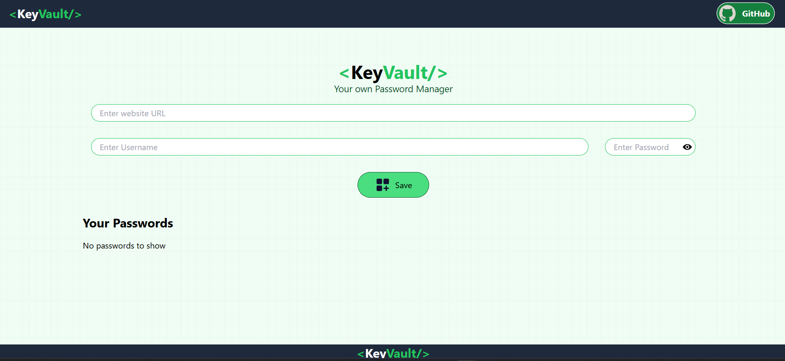
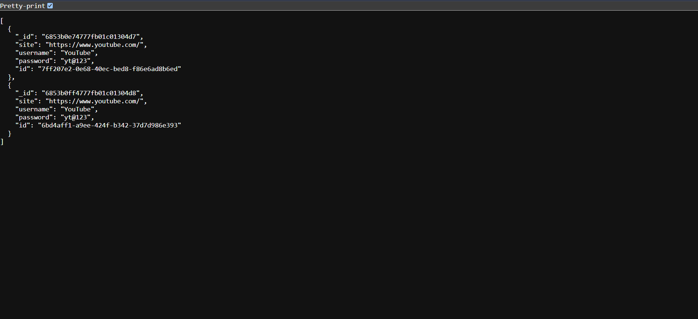

# 🔑 KeyVault - Secure Password Manager

<div align="center">
  
  <h1>KeyVault</h1>
  <p>Your personal vault for secure password management</p>
</div>

## 🚀 Overview

KeyVault is a secure, user-friendly password manager that helps you store and manage your credentials with military-grade encryption. Built with the MERN stack (MongoDB, Express.js, React, Node.js), KeyVault ensures your passwords are both secure and easily accessible when you need them.

## ✨ Key Features

- 🔐 **Secure Authentication** - JWT-based authentication with bcrypt password hashing
- 🔒 **End-to-End Encryption** - Passwords encrypted before storage
- 📱 **Responsive Design** - Works seamlessly on all devices
- 🔍 **Quick Search** - Find passwords instantly
- 📋 **One-Click Copy** - Copy credentials with a single click
- 🛡️ **Security First** - Built with security best practices
- ⚡ **Fast & Lightweight** - Built with Vite for optimal performance

## 🛠 Tech Stack

### Frontend
- ⚛️ React 18 with Hooks
- 🎨 Tailwind CSS for styling
- 🔄 React Router v6 for navigation
- ⚡ Vite for fast development and building
- 🎭 Context API for state management
- 📱 Fully responsive design

### Backend
- 🚀 Node.js & Express.js
- 🍃 MongoDB with Mongoose ODM
- 🔑 JWT Authentication
- 🔒 Bcrypt for password hashing
- 🛡️ Helmet for security headers
- 🚦 CORS enabled for secure cross-origin requests

## 🚀 Getting Started

### Prerequisites
- Node.js 16 or higher
- MongoDB Atlas account or local MongoDB instance
- npm or yarn package manager

### Installation

1. **Clone the repository**
   ```bash
   git clone https://github.com/yourusername/keyvault.git
   cd keyvault
   ```

2. **Install frontend dependencies**
   ```bash
   npm install
   ```

3. **Install backend dependencies**
   ```bash
   cd backend
   npm install
   cd ..
   ```

### Environment Setup

1. **Create `.env` file in the root directory**
   ```env
   # Frontend
   VITE_API_URL=http://localhost:3000
   ```

2. **Create `.env` file in the backend directory**
   ```env
   PORT=3000
   MONGO_URI=your_mongodb_connection_string
   JWT_SECRET=your_secure_jwt_secret
   NODE_ENV=development
   ```
   > **Note:** Replace `your_mongodb_connection_string` with your MongoDB connection string and `your_secure_jwt_secret` with a secure secret key.

### Running the Application

1. **Start the backend server**
   ```bash
   cd backend
   npm start
   node server.js
   ```

2. **In a new terminal, start the frontend**
   ```bash
   npm run dev
   ```

3. **Access the application**
   - Frontend: `http://localhost:5173`
   - Backend API: `http://localhost:3000`

## 📁 Project Structure

```
keyvault/
├── backend/             # Backend server
│   ├── config/          # Configuration files
│   ├── controllers/     # Route controllers
│   ├── middleware/      # Custom middleware
│   ├── models/          # MongoDB models
│   ├── routes/          # API routes
│   ├── server.js        # Express server
│   └── .env             # Environment variables
├── public/              # Static files
│   └── icons/           # Application icons
├── src/
│   ├── assets/          # Images, fonts, etc.
│   ├── components/      # Reusable UI components
│   │   ├── common/      # Common components
│   │   ├── layout/      # Layout components
│   │   └── ui/          # UI components
│   ├── context/         # React context providers
│   ├── hooks/           # Custom React hook    s
│   ├── pages/           # Page components
│   ├── services/        # API services
│   ├── utils/           # Utility functions
│   ├── App.jsx          # Main App component
│   └── main.jsx         # Application entry point
├── .env                 # Frontend environment variables
├── .gitignore
├── package.json
├── README.md
└── vite.config.js
```

## 📸 Screenshots

<div align="center">
  <h3>📊 Dashboard View</h3>
  
  
  <h3>🔑 Password Entry</h3>
  
  
  <h3>💾 Save Password</h3>
  
  
  <h3>❌ Delete Confirmation</h3>
  
  
  <h3>🗄️ Database View</h3>
  
</div>

## 🔄 User Flow

1. **Authentication**
   - User signs up with email and password
   - Credentials are hashed and stored securely
   - JWT token is issued upon successful login

2. **Dashboard**
   - View all saved passwords
   - Search and filter passwords
   - Add new credentials

3. **Password Management**
   - Add new credentials with site, username, and password
   - Edit existing entries
   - Delete credentials when no longer needed
   - Copy passwords to clipboard with one click

4. **Security**
   - Passwords are never stored in plain text
   - Automatic logout after period of inactivity
   - Secure session management

## 🔐 Security Features

- **Password Hashing**: All passwords are hashed using bcrypt
- **JWT Authentication**: Secure token-based authentication
- **HTTPS**: Enforced in production
- **CORS**: Configured to allow requests only from trusted origins
- **Input Validation**: Server-side validation of all user inputs
- **Rate Limiting**: Protection against brute force attacks
- **Security Headers**: Helmet middleware for secure HTTP headers

## 👥 Contributing

Contributions are what make the open-source community such an amazing place to learn, inspire, and create. Any contributions you make are **greatly appreciated**.

1. Fork the Project
2. Create your Feature Branch (`git checkout -b feature/AmazingFeature`)
3. Commit your Changes (`git commit -m 'Add some AmazingFeature'`)
4. Push to the Branch (`git push origin feature/AmazingFeature`)
5. Open a Pull Request

## 🙏 Acknowledgments

- [React](https://reactjs.org/) - A JavaScript library for building user interfaces
- [Vite](https://vitejs.dev/) - Next Generation Frontend Tooling
- [Tailwind CSS](https://tailwindcss.com/) - A utility-first CSS framework
- [MongoDB](https://www.mongodb.com/) - The database for modern applications
- [Express](https://expressjs.com/) - Fast, unopinionated, minimalist web framework for Node.js
- [Node.js](https://nodejs.org/) - JavaScript runtime built on Chrome's V8 JavaScript engine

<div align="center">
  Made with ❤️ by Swanand | 
  <a href="https://github.com/SwanandS572">
    
    GitHub
  </a>
</div>
